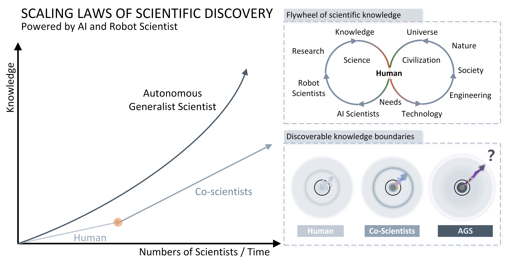
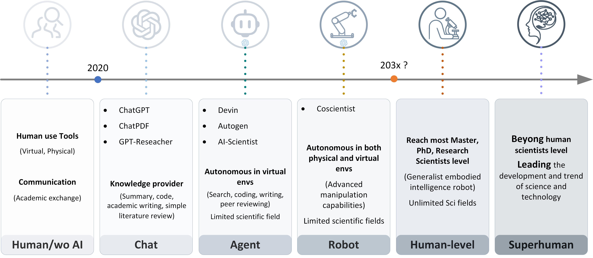

# Awesome AI Scientist Papers 


[](https://github.com/sindresorhus/awesome)
 


[](https://github.com/universea/Awesome-AI-Scientist-Papers/blob/main/LICENSE)

Welcome to the **Awesome AI Scientist Papers** repository! This project aims to curate a collection of important papers to the field of AI/Robot Scientist.

<p align="center">
  
  <br>
  <em>Scaling Laws in Scientific Discovery with AI Scientists and Robot Scientists.</em>
</p>

## Table of Contents

- [Papers](#papers)
- [Survey](#survey)
- [News](#news)
- [Benchmark](#benchmark)
- [Cite](#cite)


## Papers

- [The AutoResearch Moment: From Experimenter to Research Director](https://www.preprints.org/manuscript/202603.1329), Chaoyue He, Xin Zhou, Di Wang et al., Preprints, 2026

- [AutoNumerics: An Autonomous, PDE-Agnostic Multi-Agent Pipeline for Scientific Computing](https://arxiv.org/abs/2602.17607), Jianda Du, Youran Sun, Haizhao Yang, arXiv, 2026

- [Democratizing Discovery: How Automated Research Pipelines Make Scientific Innovation Universally Accessible](https://doi.org/10.5281/zenodo.18848462), Euan, Zenodo, 2026

- [CORAL: Towards Autonomous Multi-Agent Evolution for Open-Ended Discovery](https://arxiv.org/abs/2604.01658), Ao Qu, Han Zheng, Zijian Zhou et al., arXiv, 2026

- [Scaling Laws in Scientific Discovery with AI and Robot Scientists](https://arxiv.org/abs/2503.22444), Pengsong Zhang, Heng Zhang et al., arXiv, 2025

- [Towards Data-Centric Automatic R&D](https://arxiv.org/abs/2404.11276), Haotian Chen et al., arXiv, 2024

- [Mlr-copilot: Autonomous machine learning research based on large language models agents](https://arxiv.org/pdf/2408.14033), Ruochen Li et al., arXiv, 2024

- [Towards end-to-end automation of AI research](https://www.nature.com/articles/s41586-026-10265-5), Chris Lu et al., Nature, 2026

- [Autonomous Generalist Scientist: Towards and Beyond Human-Level Scientific Research with Agentic and Embodied AI and Robots](http://dx.doi.org/10.13140/RG.2.2.35148.01923), Pengsong Zhang, Heng Zhang et al., ResearchGate, 2024 

- [ChatGPT as Research Scientist: Probing GPT’s capabilities as a Research Librarian, Research Ethicist, Data Generator, and Data Predictor](https://doi.org/10.1073/pnas.2404328121), Steven A. Lehr et al., PNAS, 2024 


<details open>
<summary>Autonomous Literature Review</summary>

- [LLM-assisted systematic review of large language models in clinical medicine](https://www.nature.com/articles/s41591-026-04229-5), Sully F. Chen et al., Nature Medicine, 2026

- [Empowering biomedical evidence exploration and synthesis with deep knowledge graph research](https://www.nature.com/articles/s42256-026-01266-0), Zifeng Wang et al., Nature Machine Intelligence, 2026

- [SurveyX: Academic Survey Automation via Large Language Models](https://arxiv.org/abs/2502.14776), Xun Liang et al., arXiv, 2025

- [PaSa: An LLM Agent for Comprehensive Academic Paper Search](https://arxiv.org/abs/2501.10120), Yichen He et al., arXiv, 2025

- [SCILITLLM: HOW TO ADAPT LLMS FOR SCIENTIFIC LITERATURE UNDERSTANDING](https://arxiv.org/pdf/2408.15545), Sihang Li et al., arXiv, 2024

- [AutoSurvey: Large Language Models Can Automatically Write Surveys](https://arxiv.org/pdf/2406.10252), Wenjin Yao et al., arXiv, 2024

- [LLMs4Synthesis: Leveraging Large Language Models for Scientific Synthesis](https://arxiv.org/abs/2409.18812), Hamed Babaei Giglou et al., arXiv, 2024

- [PubTator 3.0: an AI-powered literature resource for unlocking biomedical knowledge](https://doi.org/10.1093/nar/gkae235), Chih-Hsuan Wei et al., Nucleic Acids Research, 2024

- [PubMed and beyond: biomedical literature search in the age of artificial intelligence](https://doi.org/10.1016/j.ebiom.2024.104988), Qiao Jin et al., eBioMedicine, 2024

</details>

<details open>
<summary>Proposal, Idea Generation</summary>

- [XunZi, an AI biologist, reveals disease-modifying targets](https://www.nature.com/articles/s41551-026-01769-6), Xinhe Huang et al., Nature Biomedical Engineering, 2026

- [Predicting new research directions in materials science using large language models and concept graphs](https://www.nature.com/articles/s42256-026-01206-y), Thomas Marwitz et al., Nature Machine Intelligence, 2026

- [AgentRxiv: Towards Collaborative Autonomous Research](https://arxiv.org/abs/2503.18102), Samuel Schmidgall et al., arXiv, 2025

- [Agent Laboratory: Using LLM Agents as Research Assistants](https://arxiv.org/abs/2503.18102), Samuel Schmidgall et al., arXiv, 2025

- [An empirical investigation of the impact of ChatGPT on creativity](https://doi.org/10.1038/s41562-024-01953-1), Byung Cheol Lee et al., Nature Human Behaviour, 2024

- [Nova: An Iterative Planning and Search Approach to Enhance Novelty and Diversity of LLM Generated Ideas](https://arxiv.org/abs/2410.14255), Xiang Hu et al., arXiv, 2024

- [Two Heads Are Better Than One: A Multi-Agent System Has the Potential to Improve Scientific Idea Generation](https://arxiv.org/pdf/2410.09403), Haoyang Su et al., arXiv, 2024

- [Can LLMs Generate Novel Research Ideas? A Large-Scale Human Study with 100+ NLP Researchers](https://arxiv.org/abs/2409.04109), Chenglei Si et al., arXiv, 2024

- [ResearchAgent: Iterative Research Idea Generation over Scientific Literature with Large Language Models](https://doi.org/10.48550/arXiv.2404.07738), Jinheon Baek et al., arXiv, 2024

- [Forecasting high-impact research topics via machine learning on evolving knowledge graphs](https://arxiv.org/abs/2402.08640), Xuemei Gu et al., arXiv, 2024

- [Large Language Models are Zero Shot Hypothesis Proposers](https://arxiv.org/abs/2311.05965), Biqing Qi et al., arXiv, 2023

- [SciMON: Scientific Inspiration Machines Optimized for Novelty](https://arxiv.org/abs/2305.14259), Qingyun Wang et al., arXiv, 2023

</details>


<details open>
<summary>Virtual, Digital, Agent, Experimentation</summary>

- [The Virtual Biotech: A multi-agent AI framework for therapeutic discovery and development](https://www.science.org/doi/10.1126/science.aeg6779), Harrison G. Zhang et al., Science, 2026

- [Discovering algorithms with computational language processing](https://www.science.org/doi/10.1126/sciadv.aea4216), Théo Bourdais et al., Science Advances, 2026

- [Large language models as uncertainty-calibrated optimizers for experimental discovery](https://www.nature.com/articles/s42256-026-01283-z), Bojana Ranković et al., Nature Machine Intelligence, 2026

- [An enzyme-specific protein language model for catalytic property prediction](https://www.nature.com/articles/s41467-026-75283-3), Chong Wang et al., Nature Communications, 2026

- [A knowledge graph framework for digital twins of chemical processes](https://www.nature.com/articles/s44286-026-00392-1), Shuyuan Zhang et al., Nature Chemical Engineering, 2026

- [AI-guided design of efficient perovskite solar cells operationally stable at 100°C](https://www.science.org/doi/10.1126/science.aef1620), Jiahao Guo et al., Science, 2026

- [A conversational multi-agent AI system for automated plant phenotyping](https://www.nature.com/articles/s41467-026-71090-y), Feng Chen et al., Nature Communications, 2026

- [Empowering AI data scientists using a multi-agent LLM framework with self-evolving capabilities for autonomous, tool-aware biomedical data analyses](https://www.nature.com/articles/s41551-026-01634-6), Dechao Bu et al., Nature Biomedical Engineering, 2026

- [An end-to-end framework for reactivity in heterogeneous catalysis](https://www.nature.com/articles/s44286-026-00361-8), Santiago Morandi et al., Nature Chemical Engineering, 2026

- [Meta-designing quantum experiments with language models](https://www.nature.com/articles/s42256-025-01153-0), Sören Arlt et al., Nature Machine Intelligence, 2026

- [SciSciGPT: advancing human–AI collaboration in the science of science](https://www.nature.com/articles/s43588-025-00906-6), Erzhuo Shao et al., Nature Computational Science, 2026

- [Generative discovery of partial differential equations by learning from math handbooks](https://www.nature.com/articles/s41467-025-65114-2), Hao Xu et al., Nature Communications, 2025

- [Multimodal learning enables chat-based exploration of single-cell data](https://www.nature.com/articles/s41587-025-02857-9), Moritz Schaefer et al., Nature Biotechnology, 2025

- [A multi-agentic framework for real-time, autonomous freeform metasurface design](https://www.science.org/doi/10.1126/sciadv.adx8006), Robert Lupoiu et al., Science Advances, 2025

- [A neural symbolic model for space physics](https://www.nature.com/articles/s42256-025-01126-3), Jie Ying et al., Nature Machine Intelligence, 2025

- [Reimagining research papers as interactive and reliable AI agents](https://www.nature.com/articles/s41586-026-11044-y), Jiacheng Miao et al., Nature, 2026

- [A collaborative agent with two lightweight synergistic models for autonomous crystal materials research](https://www.nature.com/articles/s42256-026-01298-6), Tongyu Shi et al., Nature Machine Intelligence, 2026

- [MutexaGPT: an intuition-to-design translator for physics-based enzyme engineering](https://www.nature.com/articles/s43588-026-01049-y), Qianzhen Shao et al., Nature Computational Science, 2026

- [Autonomous biomedical research with an artificial intelligence agent](https://www.science.org/doi/10.1126/science.adz4351), Kexin Huang et al., Science, 2026

- [Agon: An Autonomous Large-Scale Omnidisciplinary Research System Built on Prompt Economy](https://arxiv.org/abs/2606.24177), Youran Sun et al., arXiv, 2026

- [AutoZyme: An Autonomous Agentic Framework to Optimize Bioinformatics Software](https://www.biorxiv.org/content/10.64898/2026.06.12.731250v1), Elliot Xie et al., bioRxiv, 2026

- [An AI Co-Data-Scientist for Prioritizing Candidate Biomarkers from Wearable Sensor Data](https://arxiv.org/abs/2604.14615), Yubin Kim et al., arXiv, 2026

- [An AI system to help scientists write expert-level empirical software](https://www.nature.com/articles/s41586-026-10658-6), Eser Aygün et al., Nature, 2026

- [A multi-agent system for automating scientific discovery](https://www.nature.com/articles/s41586-026-10652-y), Ali E. Ghareeb et al., Nature, 2026

- [Accelerating scientific discovery with Co-Scientist](https://www.nature.com/articles/s41586-026-10644-y), Juraj Gottweis et al., Nature, 2026

- [An agentic framework for autonomous scientific discovery in cancer pathology](https://www.nature.com/articles/s41591-026-04357-y), Florian Trost et al., Nature Medicine, 2026

- [Bridging electron microscopy and materials analysis with an autonomous agentic platform](https://www.science.org/doi/10.1126/sciadv.aed0583), Guangyao Chen, Wenhao Yuan, Fengqi You, Science Advances, 2026

- [Towards end-to-end automation of AI research](https://www.nature.com/articles/s41586-026-10265-5), Chris Lu et al., Nature, 2026

- [CellVoyager: AI CompBio agent generates new insights by autonomously analyzing biological data](https://www.nature.com/articles/s41592-026-03029-6), Samuel Alber et al., Nature Methods, 2026

- [CASSIA: a multi-agent large language model for automated and interpretable cell annotation](https://www.nature.com/articles/s41467-025-67084-x), Elliot Xie et al., Nature Communications, 2026

- [The Virtual Lab of AI agents designs new SARS-CoV-2 nanobodies](https://www.nature.com/articles/s41586-025-09442-9),  Kyle Swanson et al., Nature, 2025

- [aiXiv: A Next-Generation Open Access Ecosystem for Scientific Discovery Generated by AI Scientists](https://arxiv.org/abs/2508.15126),  Pengsong Zhang et al., arXiv, 2025

- [GenoMAS: A Multi-Agent Framework for Scientific Discovery via Code-Driven Gene Expression Analysis](https://arxiv.org/abs/2507.21035), Haoyang Liu et al., arXiv, 2025

- [AI Mathematician: Towards Fully Automated Frontier Mathematical Research](https://arxiv.org/abs/2505.22451),  Yuanhang Liu et al., arXiv, 2025

- [NovelSeek: When Agent Becomes the Scientist -- Building Closed-Loop System from Hypothesis to Verification](https://arxiv.org/abs/2505.16938),  Bo Zhang et al., arXiv, 2025

- [Large language models for scientific discovery in molecular property prediction](https://www.nature.com/articles/s42256-025-00994-z), Yizhen Zheng et al., Nature Machine Intelligence, 2025

- [Agent Laboratory: Using LLM Agents as Research Assistants](https://arxiv.org/abs/2501.04227), Samuel Schmidgall et al., arXiv, 2025

- [AIDE: AI-Driven Exploration in the Space of Code](https://arxiv.org/abs/2502.13138), Zhengyao Jiang et al., arXiv, 2025

- [SciAgents: Automating scientific discovery through multi-agent intelligent graph reasoning](https://www.arxiv.org/abs/2409.05556), Alireza Ghafarollahi et al., arXiv, 2024

- [Empowering Biomedical Discovery with AI Agents](https://arxiv.org/abs/2404.02831), Shanghua Gao et al., arXiv, 2024

- [Intelligent software for laboratory automation](https://doi.org/10.1016/j.tibtech.2004.07.010), Ken E. Whelan et al., Trends in Biotechnology, 2004

</details>


<details open>
<summary>Physical, Robot, Experimentation</summary>

- [Design of white circularly polarized luminescence with high g<sub>lum</sub> across entire visible regions by dual-loop active learning](https://www.nature.com/articles/s41467-026-77409-z), Peng Yang et al., Nature Communications, 2026

- [AI-driven robotics for optics](https://www.science.org/doi/10.1126/sciadv.aee1381), Shiekh Zia Uddin et al., Science Advances, 2026

- [Data-driven catalyst design for direct catalytic N2O decomposition](https://www.nature.com/articles/s41467-026-75902-z), Chenxi He et al., Nature Communications, 2026

- [On-demand growth of semiconductor heterostructures guided by physics-informed machine learning](https://www.science.org/doi/10.1126/sciadv.aeb8867), Chao Shen et al., Science Advances, 2026

- [Machine learning-assisted development of a fast Mechanochemical Johnson–Corey–Chaykovsky reaction](https://www.nature.com/articles/s41467-026-75499-3), Francesco Mele et al., Nature Communications, 2026

- [Hyperspace exploration using robotics for the discovery of mechanistically distinct transformations and complex functional products](https://www.nature.com/articles/s44160-026-01096-3), Daniel Matuszczyk et al., Nature Synthesis, 2026

- [SmartTrap: automated precision experiments with optical tweezers](https://www.nature.com/articles/s41592-026-03129-3), Martin Selin et al., Nature Methods, 2026

- [Timed batch inputs unlock substantially higher yields for enzymatic cascades](https://www.nature.com/articles/s41557-026-02138-1), Miglė Jakštaitė et al., Nature Chemistry, 2026

- [Accelerated discovery of highly stable ruthenium-based high-entropy oxides for acidic oxygen evolution](https://www.science.org/doi/10.1126/sciadv.aed8479), Yuanhua Tu et al., Science Advances, 2026

- [Accelerated drug development using a digital formulator and a self-driving tableting data factory](https://www.nature.com/articles/s41467-026-71204-6), Faisal Abbas et al., Nature Communications, 2026

- [Deep active learning and knowledge transfer for rapid discovery of lithium metal battery electrolytes](https://www.nature.com/articles/s41467-026-70973-4), Xufeng Hong et al., Nature Communications, 2026

- [Active learning in latent spaces enables rapid inverse design of ferroelectric ceramics for energy storage](https://www.nature.com/articles/s41467-026-70792-7), Zhaochen Xi et al., Nature Communications, 2026

- [Data-driven intelligent carbonization unifies diverse biomass into high-performance hard carbon negative electrodes](https://www.nature.com/articles/s41467-026-70411-5), Junfeng Cui et al., Nature Communications, 2026

- [Synthetic data-driven deep learning for label-free autonomous atomic force microscopy](https://www.nature.com/articles/s41467-026-70421-3), Ruben Millan-Solsona et al., Nature Communications, 2026

- [Machine learning guided resolution of mechanical trade-off in polymer composites via stress adaptive interface](https://www.nature.com/articles/s41467-026-69872-5), Hao Wang et al., Nature Communications, 2026

- [YORU: Animal behavior detection with object-based approach for real-time closed-loop feedback](https://www.science.org/doi/10.1126/sciadv.adw2109), Hayato M. Yamanouchi et al., Science Advances, 2026

- [Deep learning drives autonomous molecular reactions with single-bond selectivity in tetra-brominated porphyrins on Au(111)](https://www.nature.com/articles/s41467-026-69080-1), Zhiwen Zhu et al., Nature Communications, 2026

- [Iterative discovery of potent polymeric antibiotics via multi-stage and multi-task learning against antimicrobial resistance](https://www.nature.com/articles/s41467-026-68682-z), Yuhui Wu et al., Nature Communications, 2026

- [MATTERIX: toward a digital twin for robotics-assisted chemistry laboratory automation](https://www.nature.com/articles/s43588-025-00924-4), Kourosh Darvish et al., Nature Computational Science, 2026

- [Adaptive AI decision interface for autonomous electronic material discovery](https://www.nature.com/articles/s44286-025-00318-3), Yahao Dai et al., Nature Chemical Engineering, 2025

- [Automation and machine learning drive rapid optimization of isoprenol production in Pseudomonas putida](https://www.nature.com/articles/s41467-025-66304-8), David N. Carruthers et al., Nature Communications, 2025

- [Self-driving lab discovers principles for steering spontaneous emission beyond conventional Fourier optics](https://www.nature.com/articles/s41467-025-66916-0), Saaketh Desai et al., Nature Communications, 2026

- [Heuristic data-driven approach for synergistic cobalt(IV)–enamine catalysis](https://www.nature.com/articles/s44160-025-00944-y), Liang Cheng et al., Nature Synthesis, 2026

- [Algorithmic iterative reticular synthesis of zeolitic imidazolate framework crystals](https://www.nature.com/articles/s44160-025-00939-9), Zichao Rong et al., Nature Synthesis, 2026

- [A software platform for real-time and adaptive neuroscience experiments](https://www.nature.com/articles/s41467-025-64856-3), Anne Draelos et al., Nature Communications, 2025

- [Discovery of highly fluorescent covalent organic frameworks through AI-assisted iterative experiment–learning cycles](https://www.nature.com/articles/s41557-025-01974-x), Liang Zhang et al., Nature Chemistry, 2025

- [Automated navigation of condensate phase behavior with active machine learning](https://www.nature.com/articles/s41467-025-64617-2), Yannick H. A. Leurs et al., Nature Communications, 2025

- [Active learning framework leveraging transcriptomics identifies modulators of disease phenotypes](https://www.science.org/doi/10.1126/science.adi8577), Benjamin DeMeo et al., Science, 2025

- [Evaluating large language model agents for automation of atomic force microscopy](https://www.nature.com/articles/s41467-025-64105-7), Indrajeet Mandal et al., Nature Communications, 2025

- [Reac-Discovery: an artificial intelligence–driven platform for continuous-flow catalytic reactor discovery and optimization](https://www.nature.com/articles/s41467-025-64127-1), Cristopher Tinajero et al., Nature Communications, 2025

- [Interpretable self-driving sputtering epitaxy reveals human-usable growth rules for β-Ga2O3 films](https://www.nature.com/articles/s41467-026-76533-0), Yuki K. Wakabayashi et al., Nature Communications, 2026

- [Rank-guided learning accelerates automated enzyme engineering](https://www.nature.com/articles/s41467-026-76264-2), Jingyi Xu et al., Nature Communications, 2026

- [An agentic artificially intelligent X-ray scientist](https://www.nature.com/articles/s42256-026-01261-5), Zhantao Chen et al., Nature Machine Intelligence, 2026

- [An autonomous lab for data-driven homogeneous catalysis](https://www.nature.com/articles/s41467-026-74425-x), J. A. Bennett et al., Nature Communications, 2026

- [Autonomous microfluidic experimentation for exploring reaction inference and synthesizing double perovskite nanoplatelets](https://www.nature.com/articles/s41467-026-72765-2), Junbin Li et al., Nature Communications, 2026

- [A flexible and affordable self-driving laboratory for automated reaction optimization](https://www.nature.com/articles/s44160-026-01053-0), Simone Pilon et al., Nature Synthesis, 2026

- [Experimental mechanician for plate lattice metamaterial discovery](https://www.nature.com/articles/s41467-026-70675-x), Songtao Hu et al., Nature Communications, 2026

- [Discovery of tunable and soluble organic emitters for solid-state lasers with a self-driving laboratory](https://www.nature.com/articles/s41467-026-69233-2), Hyun Suk Park et al., Nature Communications, 2026

- [Augmenting large language models with chemistry tools](https://www.nature.com/articles/s42256-024-00832-8), Andres M. Bran et al., Nature Machine Intelligence, 2024

- [ORGANA: A Robotic Assistant for Automated Chemistry Experimentation and Characterization](https://arxiv.org/abs/2401.06949), Kourosh Darvish et al., Matter, 2024

- [MatPilot: an LLM-enabled AI Materials Scientist under the Framework of Human-Machine Collaboration](https://arxiv.org/abs/2411.08063), Ziqi Ni et al., arXiv, 2024

- [Autonomous mobile robots for exploratory synthetic chemistry](https://www.nature.com/articles/s41586-024-08173-7), Tianwei Dai et al., Nature, 2024

- [A multi-agent-driven robotic AI chemist enabling autonomous chemical research on demand](https://doi.org/10.26434/chemrxiv-2024-w953h-v2), Tao Song et al., Chemrxiv, 2024

- [Autonomous chemical research with large language models](https://www.nature.com/articles/s41586-023-06792-0), Daniil A. Boiko et al., Nature, 2023

- [An ontology for a Robot Scientist](https://doi.org/10.1093/bioinformatics/btl207), Larisa N. Soldatova et al., Bioinformatics, 2006

</details>


<details open>
<summary>Manuscript</summary>

- [CiteSee: Augmenting Citations in Scientific Papers with Persistent and Personalized Historical Context](https://arxiv.org/abs/2302.07302), Joseph Chee Chang et al., arXiv, 2023

- [Beyond Summarization: Designing AI Support for Real-World Expository Writing Tasks](https://arxiv.org/abs/2304.02623), Zejiang Shen et al., arXiv, 2023

- [ScholarCopilot: Training Large Language Models for Academic Writing with Accurate Citations](https://arxiv.org/abs/2504.00824), Yubo Wang et al., arXiv, 2025

</details>


<details open>
<summary>Peer Review</summary>

- [A large-scale randomized study of large language model feedback in peer review](https://www.nature.com/articles/s42256-026-01188-x), Nitya Thakkar et al., Nature Machine Intelligence, 2026

- [Automated scholarly paper review: Concepts, technologies, and challenges](https://doi.org/10.1016/j.inffus.2023.101830), Jialiang Lin et al., Information Fusion, 2023

- [Automated Peer Reviewing in Paper SEA: Standardization, Evaluation, and Analysis](https://doi.org/10.48550/arXiv.2407.12857), Jianxiang Yu et al., arXiv, 2024

- [MARG: Multi-Agent Review Generation for Scientific Papers](https://arxiv.org/abs/2401.04259), Mike D'Arcy et al., arXiv, 2024

- [Project Rachel: Can an AI Become a Scholarly Author?](http://arxiv.org/pdf/2511.14819), arXiv 2511.14819, 2025.

</details>

## Survey

- [Towards self-driving laboratories in the biopharmaceutical industry](https://www.nature.com/articles/s44160-026-01131-3), Samagra Dvivedi et al., Nature Synthesis, 2026

- [Roadmap for transforming heterogeneous catalysis with artificial intelligence](https://www.nature.com/articles/s41929-026-01479-x), Hongliang Xin et al., Nature Catalysis, 2026

- [Artificial intelligence agents in cancer research and oncology](https://www.nature.com/articles/s41568-025-00900-0), Daniel Truhn et al., Nature Reviews Cancer, 2026

- [Autonomous catalysis research with human–AI–robot collaboration](https://www.nature.com/articles/s41929-025-01430-6), Negin Orouji et al., Nature Catalysis, 2025

- [The past, present and future of self-driving laboratories](https://www.nature.com/articles/s41570-026-00847-2), Richard B. Canty, Milad Abolhasani, Nature Reviews Chemistry, 2026

- [Agentic AI and the rise of in silico team science in biomedical research](https://www.nature.com/articles/s41587-026-03035-1), Binglan Li et al., Nature Biotechnology, 2026

- [What's Missing in Autonomous Research? A Systematization of Systems, Benchmarks, and Verification](https://www.researchgate.net/publication/406952713_What's_Missing_in_Autonomous_Research_A_Systematization_of_SystemsBenchmarks_and_Verification), Xingyu Ren et al., ResearchGate, 2026

- [Synergy of robotics and microfluidics for intelligent micro-and nanomanipulation](https://doi.org/10.1063/5.0275644), Mengmeng Xi, Pengsong Zhang et al., Biomicrofluidics, 2025

- [Large Language Models in Drug Discovery and Development: From Disease Mechanisms to Clinical Trials](https://arxiv.org/abs/2409.04481), Yizhen Zheng et al., arXiv, 2024

- [Towards Scientific Discovery with Generative AI: Progress, Opportunities, and Challenges](https://arxiv.org/abs/2412.11427), Chandan K Reddy et al., arXiv, 2024

- [Bridging AI and Science: Implications from a Large-Scale Literature Analysis of AI4Science](https://arxiv.org/abs/2412.09628), Yutong Xie et al., arXiv, 2024

- [Paradigm shifts from data-intensive science to robot scientists](https://doi.org/10.1016/j.scib.2024.09.029), Xin Li et al., Science Bulletin, 2024

- [A Comprehensive Survey of Scientific Large Language Models and Their Applications in Scientific Discovery](https://arxiv.org/abs/2406.10833), Yu Zhang et al., arXiv, 2024

- [Artificial Intelligence, Scientific Discovery, and Product Innovation](https://doi.org/10.1186%2F1759-4499-2-1), Toner-Rodgers Aidan, aidantr.github.io, 2024

- [AI for Science: AI enabled scientific facility transforms fundamental research](https://bulletinofcas.researchcommons.org/journal/vol39/iss1/8/), Xiaokang Yang, Bulletin of Chinese Academy of Sciences, 2024

- [Towards robot scientists for autonomous scientific discovery](https://doi.org/10.1186%2F1759-4499-2-1), Andrew Sparkes et al., Automated experimentation, 2010

## News

- [Accelerating Discovery in Natural Science Laboratories with AI and Robotics: Perspectives and Challenges from the 2024 IEEE ICRA Workshop, Yokohama, Japan](https://arxiv.org/abs/2501.06847), Andrew I. Cooper et al., IEEE ICRA Workshop, 2024

- [A new golden age of discovery](https://storage.googleapis.com/deepmind-media/DeepMind.com/Assets/Docs/a-new-golden-age-of-discovery_nov-2024.pdf), Conor Griffin et al., Google DeepMind, 2024

- [Transforming science labs into automated factories of discovery](https://doi.org/10.1126/scirobotics.adm6991), Angelos Angelopoulos, Science Robotics, 2024

- [Researchers built an ‘AI Scientist’ — what can it do?](https://doi.org/10.1038/d41586-024-02842-3), Davide Castelvecchi et al., Nature, 2024 

- [How to Enter the Chen Institute & Science Prize for AI Accelerated Research](https://www.science.org/content/page/how-enter-chen-institute-science-prize-ai-accelerated-research),   ChenSciencePrize@aaas.org et al., Science, 2024

- [Advancing scientific discovery with the aid of robotics](https://www.science.org/doi/10.1126/scirobotics.adt3842), Amos Matsiko, Science Robotics, 2024


## Benchmark

- [Evaluating LLMs' divergent thinking capabilities for scientific idea generation with minimal context](https://www.nature.com/articles/s41467-026-70245-1), Kai Ruan et al., Nature Communications, 2026

- [Benchmarking large language models on safety risks in scientific laboratories](https://www.nature.com/articles/s42256-025-01152-1), Yujun Zhou et al., Nature Machine Intelligence, 2026

- [Assessing AI's cognitive abilities for scientific discovery in the field of systems vaccinology](https://www.science.org/doi/10.1126/sciimmunol.adx1794), Lucie Rodriguez-Coffinet et al., Science Immunology, 2025

- [AgentIdeaBench: Benchmarking Scientific Ideation in the Agent Era](https://arxiv.org/abs/2609.07611), Yunxiang Mo et al., arXiv, 2026
- [MLS-Bench: A Holistic and Rigorous Assessment of AI Systems on Building Better AI](https://arxiv.org/abs/2605.08678), Bohan Lyu et al., arXiv, 2026

- [REFUTE: Scientific Critique & Epistemic Calibration Benchmark](https://huggingface.co/datasets/BGPT-OFFICIAL/refute) — Apache-2.0 Hugging Face benchmark for calibrated critique of recent science paper summaries. [Technical report](https://huggingface.co/datasets/BGPT-OFFICIAL/refute/blob/main/TECHNICAL_REPORT.md)

- [GenoTEX: An LLM Agent Benchmark for Automated Gene Expression Data Analysis](https://arxiv.org/abs/2406.15341), Haoyang Liu et al., MLCB, 2025

- [CORE-Bench: Fostering the Credibility of Published Research Through a Computational Reproducibility Agent Benchmark](https://arxiv.org/pdf/2409.11363v1), Zachary S. Siegel et al., arXiv, 2024

- [CiteBench: A benchmark for Scientific Citation Text Generation](https://arxiv.org/abs/2212.09577), Martin Funkquist et al., Conference on Empirical Methods in Natural Language Processing, 2022

## Timeline

<p align="center">
  
  <br>
  <em>This timeline illustrates key milestones and future predictions in the development of autonomous AI Scientist and Robot Scientist.</em>
</p>


## Discussions

We love connecting with the community to discuss AI and Robot Scientist research, share insights, and collaborate on groundbreaking ideas! Join us on the following platforms:

- **Slack**: Connect with us on Slack for professional conversations, paper discussions, and networking with the AI research community.  
  [Join Slack](https://join.slack.com/t/awesome-ai-scientist/shared_invite/zt-35r3m9jeq-yT48jva9uqfIDDE5GCjoBQ)

- **WeChat Group**: Join our WeChat group to discuss papers, share updates, and collaborate. Contact an admin (pengsong dot zhang@mail.utoronto.ca) to join.

We’re excited to hear your thoughts and contributions in our community!

## Contributing

We welcome contributions to make this repository a richer resource for the AI and Robot Scientist community! To contribute:

1. **Add Papers**: Suggest new papers by submitting a pull request with the paper’s title, authors, link, and publication details in the appropriate section.
2. **Enhance Content**: Propose improvements to categories, summaries, or timelines.
3. **Report Issues**: Open an issue for typos, broken links, or suggestions.

## Cite
```
bibtex
@article{zhang2025scaling,
  title={Scaling Laws in Scientific Discovery with AI and Robot Scientists},
  author={Zhang, Pengsong and Zhang, Heng and Xu, Huazhe and Xu, Renjun and Wang, Zhenting and Wang, Cong and Garg, Animesh and Li, Zhibin and Ajoudani, Arash and Liu, Xinyu},
  journal={arXiv preprint arXiv:2503.22444},
  year={2025}
}

@article{zhangautonomous,
  title={Autonomous Generalist Scientist: Towards and Beyond Human-Level Scientific Research with Agentic and Embodied AI and Robots},
  author={Zhang, Pengsong and Zhang, Heng and Xu, Huazhe and Xu, Renjun and Wang, Zhenting and Wang, Cong and Garg, Animesh and Li, Zhibin and Liu, Xinyu and Ajoudani, Arash},
  journal={ResearchGate preprint RG.2.2.35148.01923},
  year={2024}  
}
```
## License
MIT
